## About me

* SME/Senior Faculty with Jigsaw Academy
* Been in Academia prior to Jigsaw taught courses in Statistics, Research Methods @ GNDU, Amritsar
* Academics: Statistics, Maths and Economics

--- .class #id 
## Assumptions I make about you

* Interested in text analysis
* Know python and have some expericen with data analysis 
* Have seen and played with jupyter notebooks

--- .class #id

## Agenda

* Text mining what and why?
* Representing text for ML tasks:
  * Can we predict when trump tweets?
  * Summarizing ted talks
  * Recommending ted talks to watch
* NLP and aspect extraction
  * What do people talk about in Amazon reviews?
* Word vectors and Aspect Synonyms
  * Do people mention food more than service in hotel reviews?
* Aspect based sentiment analysis
  * Tying the loose ends

--- .class #id

## Pre-requisites
You have python anaconda installed along with spacy and textblob.If so, all the codes are hosted <a href="https://github.com/Gunnvant/code_demos">here</a>, please download this repo.

If not I have created a lab environment. This cloud instance takes around 3-4 minutes to spin up, so you can <a href="https://mybinder.org/v2/gh/Gunnvant/code_demos/master">click</a> here and start the lab

--- .class #id

## Text mining: what and why?

--- .class #id

## Text mining: what and why?

  

    
  

  

    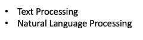
  

--- .class #id

## Text mining: what and why?

  

    
  

  

    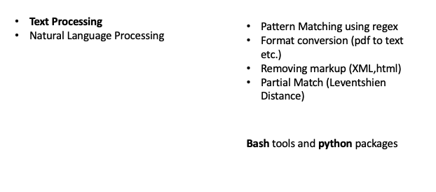
  

--- .class #id

## Text mining: what and why?

  

    
  

  

    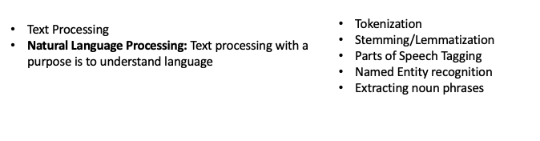
  

--- .class #id

## Text mining: what and why?

  

    
  

  

    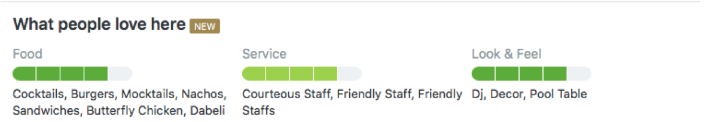
  

--- .class #id

## Text mining: what and why?

  

    
  

  

    
  

  

    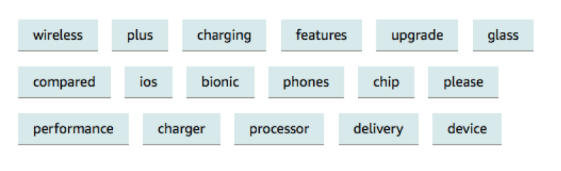
  

--- .class #id

## Representing text for ML tasks

Most ML tasks are centered around finding a mapping between predictors and labels

$$labels=f(Predictors)$$

--- .class #id

## Representing text for ML tasks

Most ML tasks are centered around finding a mapping between predictors and labels

$$labels=f(Predictors)$$

And this is how mostly data should be laid out if any ML is to used:

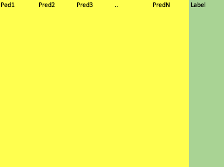

--- .class #id 

## Representing text for ML tasks

But what will you do if you want use text as an input to an ML task?

|        Predictor        | Label |
|:-----------------------:|:-----:|
| This Joke is very funny |  Haha |
|  This Joke is not funny |  Meh  |
|        Good joke        |  Haha |
|      Pathetic joke      |  Meh  |

The underlying assumption while doing any kind of ML task is that one can ***estimate*** the functional dependence $f$ between predictors and targets

$$labels=f(Predictors)$$

To find any sort of functional dependence one will need to represent both predictors and labels as numbers

--- .class #id

## Representing text for ML tasks
Its easier to deal with labels:

|        Predictor        | Label |
|:-----------------------:|:-----:|
| This Joke is very funny |  1 |
|  This Joke is not funny |  0  |
|        Good joke        |  1 |
|      Pathetic joke      |  0  |

But how do we handle the text?

--- .class #id
## Representing text for ML tasks

Traditionally we can use a BOW (Bag of words approach to represent text)

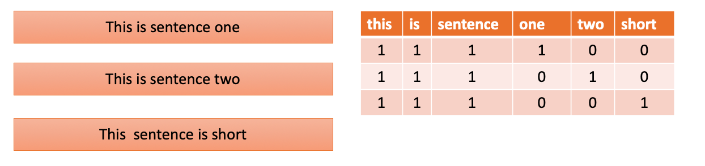

--- &submitcompare1
## Representing text for ML tasks
The problem with BOW represetntation of text is:

*** .explanation
The problem with BOW representation is that the importance of the words is not captured only counts are considered.

--- .class #id
## Representing text for ML tasks

An imporovement on the BOW approach is the tfidf representation

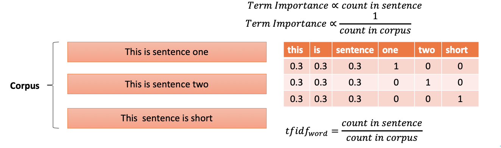

---  &checkbox
## Representing text for ML tasks

If you use tfidf representation on a corpus which is fairy large, then (Choose the ones which are correct)

1. _One can end up with a tfidf matrix with many columns_
2. _The order of the words will not be retained_
3. Very compact representation of the text will be obtained
4. Nothing could go wrong in life !!!

*** .explanation
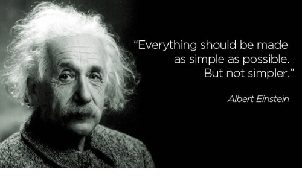

--- .class #id

## Can we predict when trump tweets?

Let's head over to our lab to see how we can predict if a tweet is made by Donald Trump or by some-one else.

--- .class #id

## Summarising ted talks

Let's take another example to see how we can use tfidf representation in other creative ways. We will take a look at a dataset and try to extract "important" terms out of this document. All we will need to do is pick up the words that have very high tfidf scores.

Doing this will make sense when you have a text corpus which respects the rules of standard english grammar and uses standard english vocabulary.

Let's visit the lab again, you can follow along locally as well.

--- .class #id

## Representing text for ML tasks

Another thing that any numerical representtion of text enables us to do is, in establishing similarity over text. This can aid in doing text search and hence in aid in recommendations.

The idea is that two similar pieces of text will have similar tfidf representation.

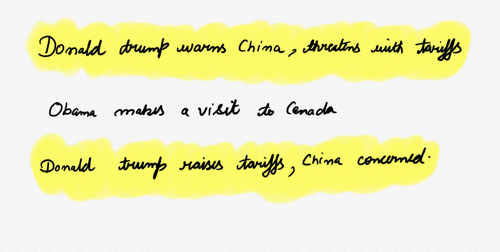

--- .class #id

## Representing text for ML tasks

<iframe width="402" height="346" frameborder="0" scrolling="no" src="https://onedrive.live.com/embed?resid=93C4DDFD9869A0CF%217497&authkey=%21ABggvfn_ilB-TX8&em=2&AllowTyping=True&ActiveCell='Sheet1'!E3&wdInConfigurator=True"></iframe>

--- .class #id

## Representing text for ML tasks

One very popular way of finding the distance between vectors is to use cosine distance. 

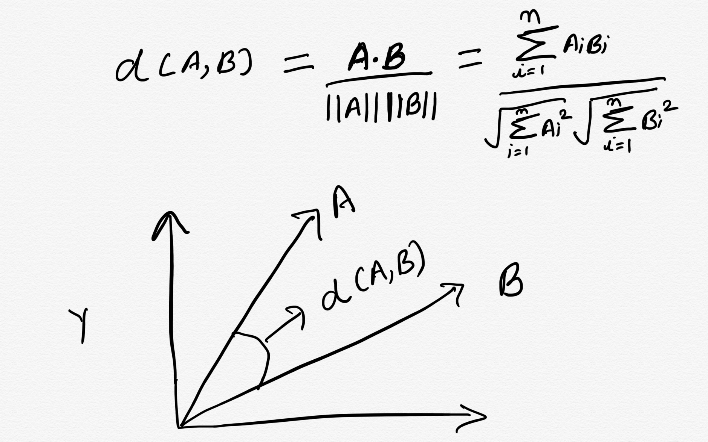

--- .class #id

## Recommending ted talks

The ideas discussed can be summarised as below:

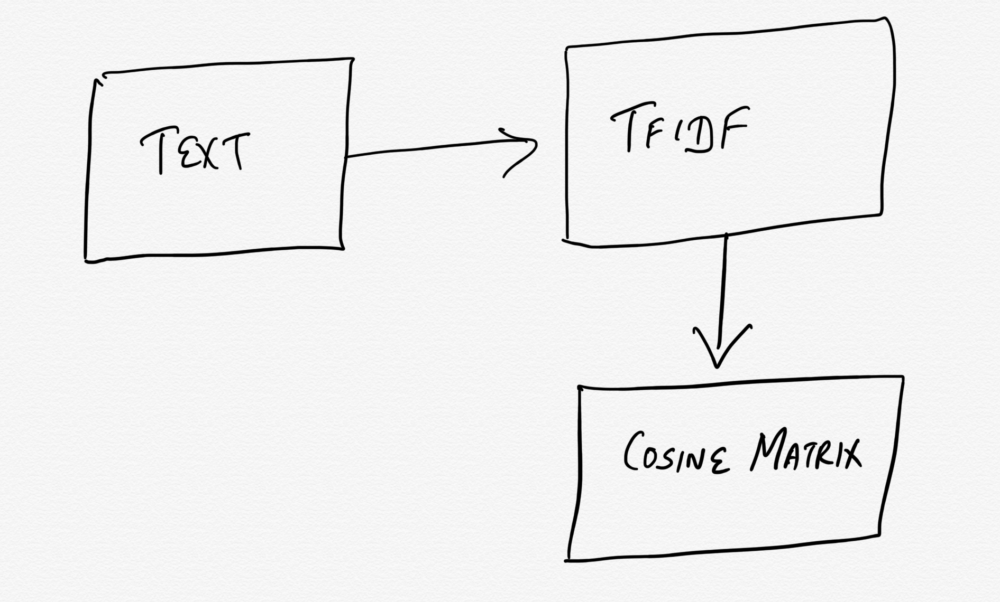

These basic building blocks can be used to create contextual search recommendation. Head over to the lab/local code

--- .class #id

## NLP and aspect extraction

Let's now turn our attention to what NLP is and how it can help us in different business contexts. 
But what is NLP?

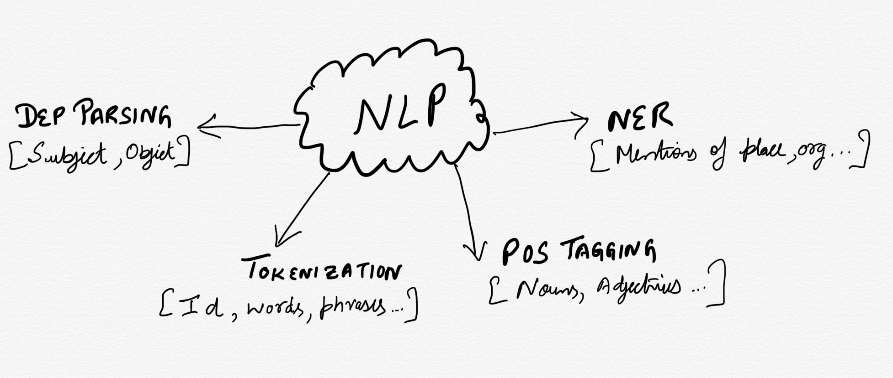

--- .class #id

## NLP and aspect extraction

So, how does the ability to do POS tagging or finding out Subject-Object relationships help us?
Sample the sentences below

1. I loved the camera in this mobile phone. But I hated the build quality
2. The beach has amazing views. Food is great. Drinks are even better and 
locals are friendly

Can you see how POS tagging be of any use here?
Let's again go back to our lab and work with nlp_basic.ipynb 

--- .class

## NLP and aspect extraction: What people in Amazon Reviews talk about?

What does this leads to?

If you are interested in finding what people are talking about:

* Label all the words with their pos tag 
* Count frequently occuring nouns

Let's head back to our notebook.

--- .class #id

## Word vectors and aspect synonyms

The approach discussed so far is useful if you want to do some exploratory analysis. The approach will be useful if you don't know what people are talking about. 

What if you already knew what are the aspects you would want to search for? You can use word vectors to find out words similar to the aspects that you have finalised.

--- .class #id

## Word vectors and aspect synonyms

But first let's talk about word vectors? What will happen if following sentences are represented by tfidf vectors?

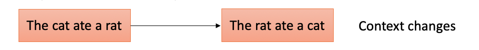

--- &checkbox

## Word vectors and aspect synonyms

But first let's talk about word vectors? What will happen if following sentences are represented by tfidf vectors?

1. Nothing at all
2. _Something_
3. _Something not appropropriate_
4. _I have not listed the most appropriate option_

*** .explanation

--- .class #id

## Word vectors and aspect synonyms

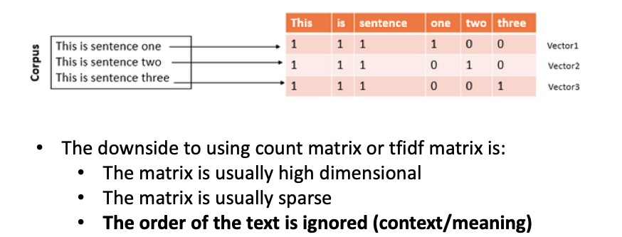

--- .class #id

## Word vectors and aspect synonyms

So, what can be done? Before word vectors became popular people experimented with Markov models where one essentially creates a probability distribution on co-occurence of words something like this:

$$P(word_i | word_j) \forall (word_i,word_j)$$

This partially solves the problem of getting some sense of co-occurence of words.

Word vectors solve this problem by creating vector representation of words in such a manner the co-occurence structure of words is retained.

--- .class #id

## Word vectors and aspect synonyms

One makes use of neural networks while creating word vectors. Here is a schematic:

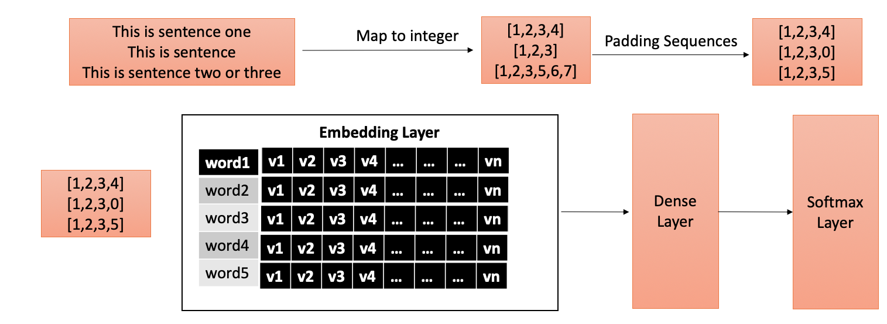

--- .class #id

## Word vectors and aspect synonyms

One makes use of neural networks while creating word vectors. Here is a schematic:

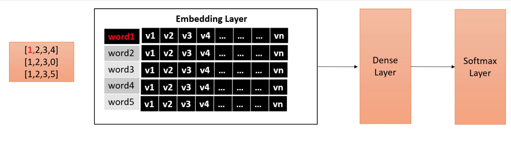

--- .class #id

## Word vectors and aspect synonyms

This training process results in vector representation of each word in the corpus being learnt:

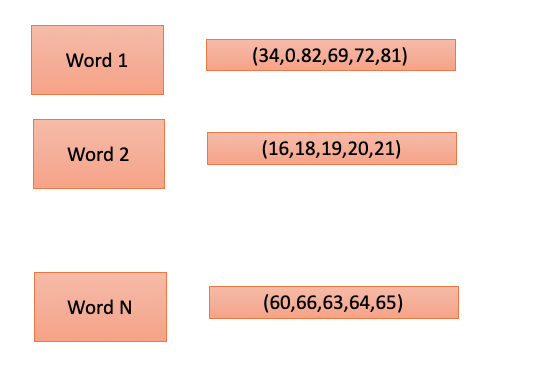

--- .class #id

## Word vectors and aspect synonyms

But what to train for?

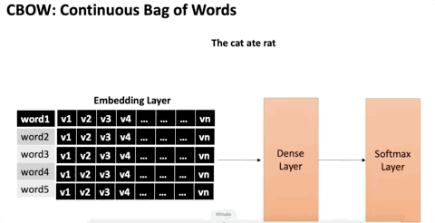

--- .class #id

## Word vectors and aspect synonyms: Food or Service

How can word vectors help us?

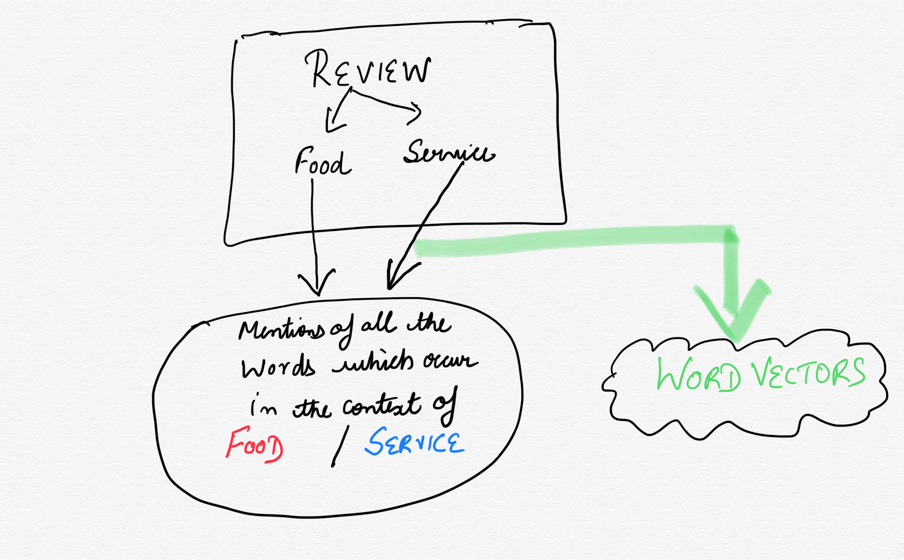

Let's headover to the lab once again and see how we can extract mentions of specific aspects

--- .class #id

## Aspect Based Sentiment Analysis:

In aspect based sentiment analysis we try to find out what people's opninons are about different aspects of a product.

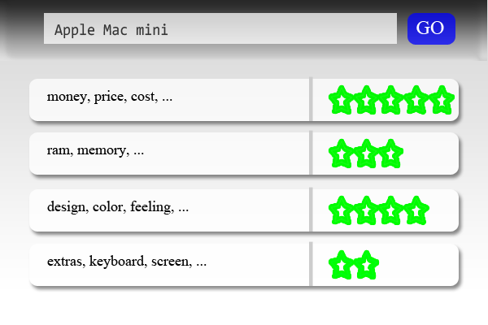

--- .class #id

## Aspect Based Sentiment Analysis:

One way in which this problem can be solved for is by treating this problem as supervised ML task by labelling the data as follows:

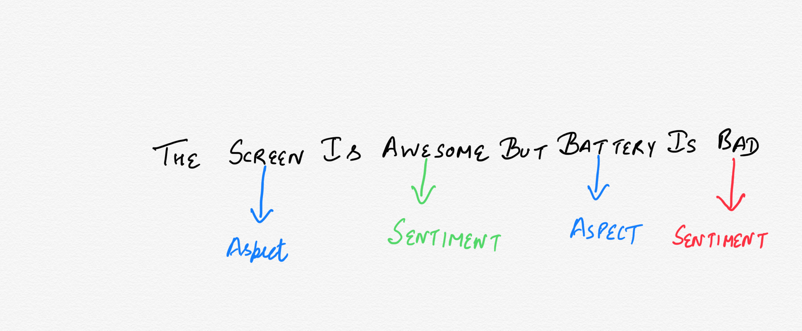

--- .class #id

## Aspect Based Sentiment Analysis:

One way in which this problem can be solved for is by treating this problem as supervised ML task by labelling the data as follows:

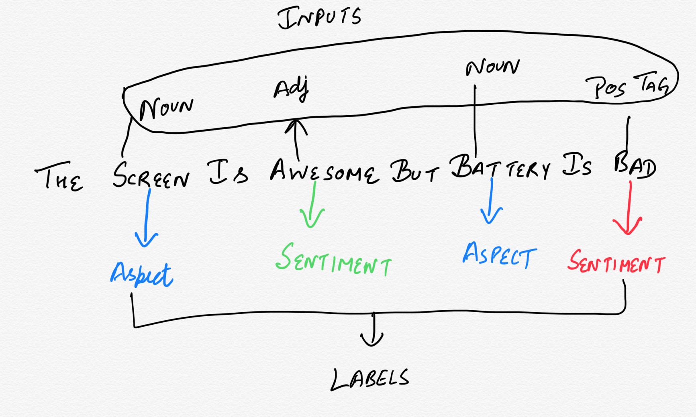

--- .class #id

## Aspect Based Sentiment Analysis:

One way in which this problem can be solved for is by treating this problem as supervised ML task by labelling the data as follows:

Labour intensive probably not a good idea idea if MVP is all you want to build. In the long term though this is what one should do ideally.

--- .class #id

## Aspect Based Sentiment Analysis:

What can we do then if we want to build a quick and dirty MVP?

We already have pre-trained sentiment analysers:

1. Lexicon based (Count nouns, adjectives and match with an existing list of positve/negative words)
2. Pre-trained ML models

--- .class #id

## Aspect Based Sentiment Analysis: Tying the loose ends

1. Use word vectors to find mentions of aspect categories
2. Use pre-trained models or lexicons to find sentiment of sentence fragments (noun phrases in which aspects occur)

Let's see an example and head over to the lab

--- .class #id

## Things I have not talked about:

1. How to test how good such a system is?
2. How to treat this as supervised learning problem?

--- .class #id

## Thank you, any questions?

